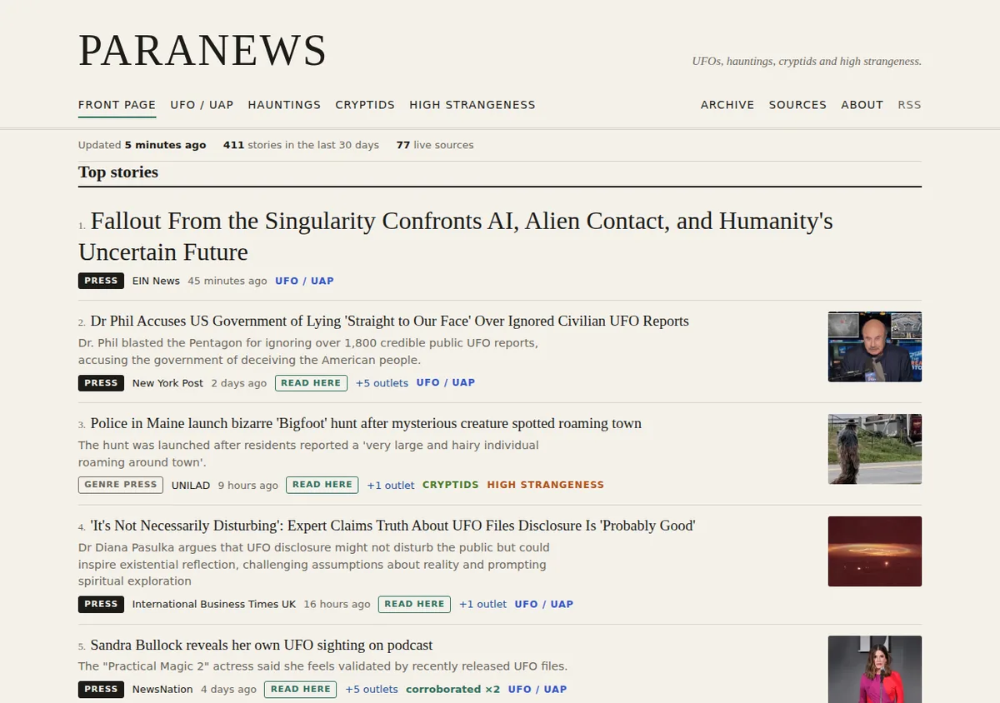
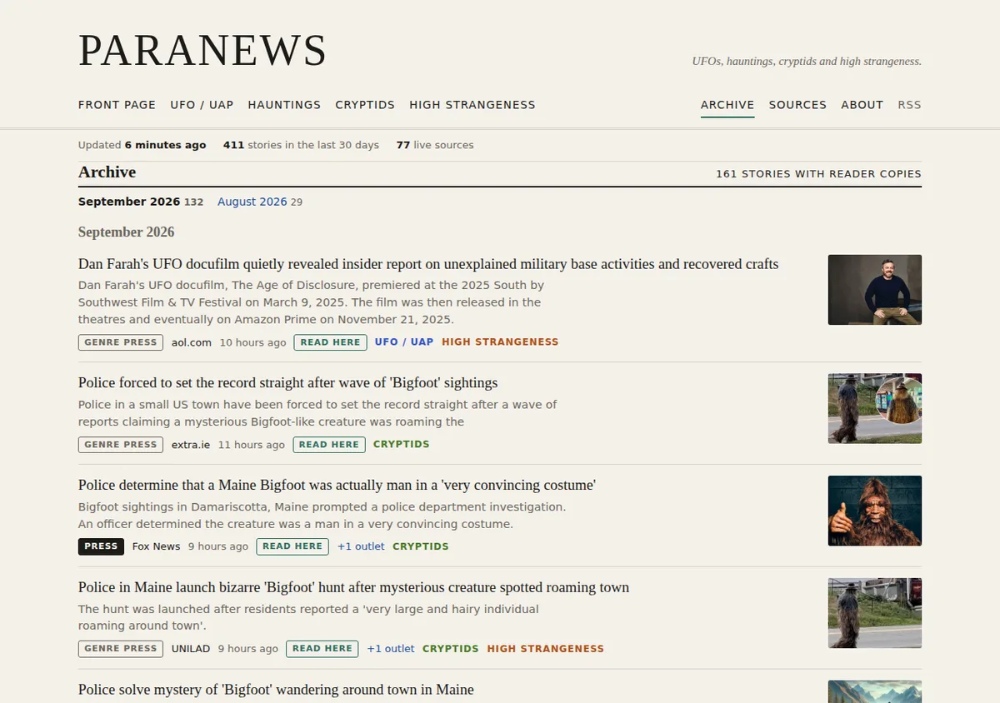

# Paranews

A self-updating news wire for the paranormal: UFO/UAP, hauntings, cryptids and high strangeness. It reads ~79 sources every half hour, folds the same story from different outlets into one entry, grades every entry by *who* published it, ranks the result and publishes a static site to GitHub Pages. It writes nothing of its own: no generated summaries, no language model anywhere in the pipeline. Each story keeps a reader-mode copy of one outlet's article, opened in place with the original linked.

**Live site:** https://news.asr.institute/

## Screenshots







## How it works

```
GitHub Actions cron (*/30)
  fetch ─► normalize ─► store (data/items/YYYY-MM-DD.json, committed)
                          │
                          ├─► resolve link ─► reader copy + lead image (data/articles/, data/images/, committed)
                          │
                          astro build ─► cluster ─► rank ─► static HTML ─► GitHub Pages
```

- **Items are the source of truth, clusters are derived.** Every feed entry ever seen is committed as JSON, one file per publication day, one item per line, sorted by id. Git history *is* the archive: `git show <sha>:data/items/2026-09-05.json` reconstructs any day. Clusters and rankings are recomputed at build time, so improving the grouping never requires touching data.
- **Google News searches are the backbone.** One RSS search per beat, across the US, UK, Australian, Canadian and Irish editions, returns ~100 fresh headlines each with the publisher name — no auth, no bot walls. The extra editions were measured, not assumed: on the same query, AU, CA and IE each return 14–33 stories a week that the US and GB editions never carry. Direct feeds from genre outlets, science desks, sceptics, university research units and journals add real links, snippets and personality.
- **The official tier is filled by construction, not by hope.** General institutional feeds were probed and rejected: DoD, GAO, NASA, ESA, Nature, Science, PNAS, PLOS ONE and gov.uk MOD scored zero on-beat headlines across 348 titles between them. "topics: auto will filter it" is true and useless when the filter passes nothing. What works is feeds that are on-beat by subject — The Conversation's per-topic Atom feeds, arXiv's UAP query, a university research unit, a learned society. Official stories are rare and are covered once, so they score far below widely-covered stories and get their own front-page column rather than a thumb on the ranking scale.
- **Reddit, by the only route Reddit permits.** reddit.com/robots.txt is `User-agent: * / Disallow: /` on every host it serves, RSS included, and its API rules forbid browser-UA spoofing. So the site uses application-only OAuth, credentials from repository secrets, and skips the source entirely when they are absent. A post linking to a publisher is filed under that publisher and graded by its tier; a self post stays unverified and needs heavy community endorsement, because most of a subreddit's new queue is anecdote. (The old 429s had the same root: unauthenticated Reddit allows roughly one request a minute *per IP*, and an Actions runner shares its Azure range with thousands of tenants.)
- **Grouping is lexical.** Headlines become bags of stemmed words weighted by rarity across the current month (IDF-weighted Jaccard). Sharing "ufo" and "sighting" means nothing; sharing "pentagon", "private" and "archive" means a lot. Union-find with a 72-hour pair window and a 7-day span guard. The 0.3 threshold was chosen against live data: every extra merge between 0.5 and 0.3 was a genuine match.
- **Tiers are a lookup, not a judgement.** `official` (wires, government, journals) → `press` (mainstream and local newsrooms) → `genre` (genre press, tabloids, enthusiast sites) → `unverified` (social, single-witness blogs). Assigned per publisher from `config/sources.yml`, never from the story text. Deterministic and auditable.
- **Ranking:** `Σ tier weight per independent write-up × (1 + ln write-ups) ÷ (hours since latest coverage + 6)`. An independent write-up is a connected component over two axes: two reports are the same write-up when they share a headline **or** share a publisher. Both directions were real scoring bugs — twenty Gray Media affiliates running one syndicated Sasquatch headline are one write-up, and so are three rewrites of one Loch Ness sighting by the same tabloid, which had been outranking a seven-outlet press story. Attractions, perennial listicles and organisational notices are demoted, never hidden.
- **Entertainment is filtered out, not demoted.** Films, television, games, books, stage and music — fiction and its promotion — never reach the site. Two signals: contextual headline patterns in `pipeline/classify.ts` (tuned against the archive so "witness films three orbs", "investigation at the Opera House" and "study shows" don't match) and an entertainment-outlet list under `publishers.entertainment` in `config/sources.yml` (IMDb, Deadline, Bloody Disgusting, JoBlo, Playbill, …). A cluster is hidden when a strict majority of its members carry the flag, so a celebrity's real sighting survives an entertainment site also running it. Two more filters hide the noise a search backbone drags in: `offbeat` (a beat word as a ticker, product or team name — "NASDAQ: UFO", "Norco Bigfoot 2 for sale", "Raleigh Aaro girls soccer") and `weak-match` (a Google News hit whose headline names nothing from any beat — in practice explosions, crashes, obituaries and game guides). Flags are recomputed at build time, so a classifier fix applies to the whole archive on the next run; `npm run clusters -- --hidden` lists what the filters removed.
- **One reader copy per story, kept for good.** After ingest, `scripts/articles.ts` takes each visible story's best outlet, resolves its link (Google News ids are decoded through the interstitial's signature and the page's own data endpoint; older ids carry the URL in the base64), checks robots.txt, fetches the page as a browser would, and keeps what reader mode would show: Mozilla Readability picks the article, `sanitize-html` reduces it to plain document markup, the lead image (og:image, else the first body image) becomes an 800px WebP. Pages behind a bot wall, galleries, videos, social platforms and anything under 150 words are skipped and the story's next outlet is tried; failures back off (2 h, 8 h) and stop after three. Copies live under `data/articles/<item id>.json` and `data/images/<item id>.webp` and are never pruned. The site serves them as `/reader/<id>.json` + `.webp`; "Read here" opens the copy in a dialog over the blurred page, with the original linked top and bottom; `/archive/` lists every story with a copy, by month. Resolved links also replace the opaque Google News URLs in `data/items/`, so story links go straight to the publisher.
- **An empty feed is not a broken feed.** Rolling tag feeds (`/tag/<slug>/feed/`, Reach's `/all-about/<slug>?service=rss`) carry a seven-day window and are legitimately empty in a quiet week. Treating that as a failure quarantined every one of them within 90 minutes, so emptiness is tolerated for a day of polls before it counts.
- **Source health:** per-feed ETag/Last-Modified caching, browser user agent (several publishers refuse anything else), three consecutive failures → quarantine → daily re-probe → auto-heal, and a `source-health` GitHub issue when a feed is quarantined.

## Repository layout

```
config/sources.yml        feed registry, publisher → tier table, retired feeds with notes
pipeline/                 pure modules: feeds, normalize, classify, store, health, cluster, rank,
                          gnews (Google News link decoding), reddit (OAuth app-only client),
                          fetch, robots, reader, images, articles
pipeline/*.test.ts        node:test suites
scripts/ingest.ts         poll sources → data/  (npm run ingest)
scripts/articles.ts       reader copies for new stories → data/articles/, data/images/  (npm run articles)
scripts/clusters.ts       dump clusters to .cache/clusters.json for inspection (npm run clusters)
scripts/quarantine-report.ts  issue payloads for newly quarantined sources
data/items/               committed archive, one file per UTC publication day
data/articles/            reader copies, one JSON per item, kept for good
data/images/              lead-image thumbnails (WebP, ≤800px), kept for good
data/article-status.json  failed fetch attempts in the current window and when to retry
data/health.json          per-source status, validators, last error
data/meta.json            last run time and counts
src/                      Astro site: front page, beat pages, story pages, archive, about, sources,
                          reader dialog, /reader/<id>.json + .webp, rss.xml + rss/<beat>.xml, sitemap
.github/workflows/update.yml   schedule → test → ingest → archive articles → commit → build → deploy
.github/workflows/ci.yml       test + typecheck + build on pull requests
```

## One-time setup

The schedule runs on whichever branch is the repository's **default branch** — the workflows follow it by name, so it can be `main` or anything else. (This branch became the default when it was pushed to the empty repository; rename it to `main` under Settings → Branches if you prefer, nothing else needs to change.)

1. Settings → Pages → **Source: GitHub Actions**. The workflow also tries to enable this itself (`actions/configure-pages` with `enablement: true`); if the first run's deploy job fails, flip the setting and re-run.
2. Actions → *Update site* → **Run workflow** for an immediate first publish. After that it runs itself every 30 minutes.

**Custom domain?** Add it under Settings → Pages. The workflow reads the origin and base path GitHub reports, so nothing in the code changes.

**Private repository?** Every run costs ~2 Actions minutes; 48 runs a day is ~3,000 minutes a month, above the 2,000 free for private repos. Change the cron to `0 * * * *` (hourly). Public repositories have unlimited minutes.

**Schedule caveats:** GitHub runs cron best-effort (5–15 minutes of drift is normal) and disables schedules after 60 days without repository activity. The data commits normally keep it alive; if the schedule ever stops, re-enable it under Actions.

## Local development

```sh
npm ci
npm run ingest      # poll every enabled source into data/ (idempotent; safe to re-run)
npm run articles    # reader copies for stories that lack one (--limit N, --budget S, --dry-run)
npm run clusters    # print the ranked clusters, write .cache/clusters.json
npm run dev         # Astro dev server on http://localhost:4321/paranews/
npm test
npm run typecheck
npm run build       # dist/
```

`npm run clusters -- --threshold 0.35` tries a different similarity cutoff without touching data. Node ≥ 22.18 runs the TypeScript directly (no build step, no `tsx`).

## Reddit (optional)

Reddit is skipped unless credentials are present, so the site builds fine without it. To enable:

1. Register a **script** app at https://www.reddit.com/prefs/apps (Reddit's Responsible Builder Policy
   may route new registrations through manual approval).
2. Add repository secrets `REDDIT_CLIENT_ID` and `REDDIT_CLIENT_SECRET`, and optionally
   `REDDIT_USERNAME` so the user agent identifies you the way Reddit's rules require.
3. Pass them through to the ingest step in `.github/workflows/update.yml`.

Do not point a `kind: rss` source at a reddit.com URL. It is disallowed by their robots.txt and by
their API rules, and it will be rate-limited to uselessness from CI in any case.

## Editing sources

Everything editorial lives in `config/sources.yml`:

- **Add a feed:** an entry with `kind: rss`, a `url`, a `tier`, and either fixed `topics: [ufo]` or `topics: auto` (headline classifier decides; add `default_topic` to keep unmatched items, omit it to drop them — the right choice for a general science feed).
- **Add a Google News beat:** `kind: google-news`, `edition: US|GB`, and a `query` of **at most 190 characters**. Google silently drops the `when:7d` recency operator on long queries and returns years-old results; validation refuses longer queries. Split a beat into several short queries instead.
- **Fix a tier:** add the publisher's name to the right list under `publishers:`. Exact names win over the regex patterns (local call signs, newspaper naming conventions); anything unknown defaults to `genre`.
- **Hide an outlet's coverage:** add it to `publishers.entertainment` (or extend `entertainment_patterns`). Use it for outlets that only ever cover the paranormal as media — trades, fan sites, theatre and music press.
- **Retire a feed:** `enabled: false` plus a `note:` saying why, so the next person doesn't rediscover the same dead path.

Query words that looked reasonable and were not: `haunted`/`haunting` (metaphors, LEGO sets), `yeti` (coolers), `dogman` (children's books), bare `loch ness` (tourism), `jersey devil` (NHL), `skinwalker ranch`/`ancient aliens`/`bermuda triangle` (TV promos), `reincarnation` (anime), `mysterious disappearance`/`vanished without a trace` (true crime). They are documented in the registry. Reddit and The Daily Grail are retired because GitHub Actions runners get 429/403 from them.

## Tuning

- Similarity threshold, pair window and span guard: `pipeline/cluster.ts` (`DEFAULTS`).
- Tier weights, flag penalties and the age offset: `pipeline/rank.ts`.
- Topic and flag keyword rules: `pipeline/classify.ts` — precision over recall; a wrong beat is worse than a missed one, and a false entertainment match hides a real story.
- Which flags hide a story: `HIDDEN_FLAGS` in `pipeline/visibility.ts` (add `attraction` there to hide Halloween attractions too; remove `weak-match` to let keyword-less search hits back in).
- Window (30 days on site), max age at ingest (45 days), quarantine threshold (3), re-probe interval (24 h): `pipeline/config.ts`, `scripts/ingest.ts`, `pipeline/health.ts`.

## What it deliberately doesn't do

- Summarize or rewrite anything. The reader copy is the publisher's text as reader mode would show it, sanitized, with the original linked; snippets are the feeds' own descriptions or the copy's first lines, capped at 300 characters.
- Scrape sighting databases. NUFORC's terms forbid scraping and redistribution; that data is available by asking them, not by crawling.
- Depend on Google News links resolving. Identity is `hash(headline, publisher)`, so a decode failure costs a reader copy, not a story; the decode path is undocumented and may stop working without notice.
- Judge claims. The tier says what kind of outlet published something; nothing here says whether it happened.
